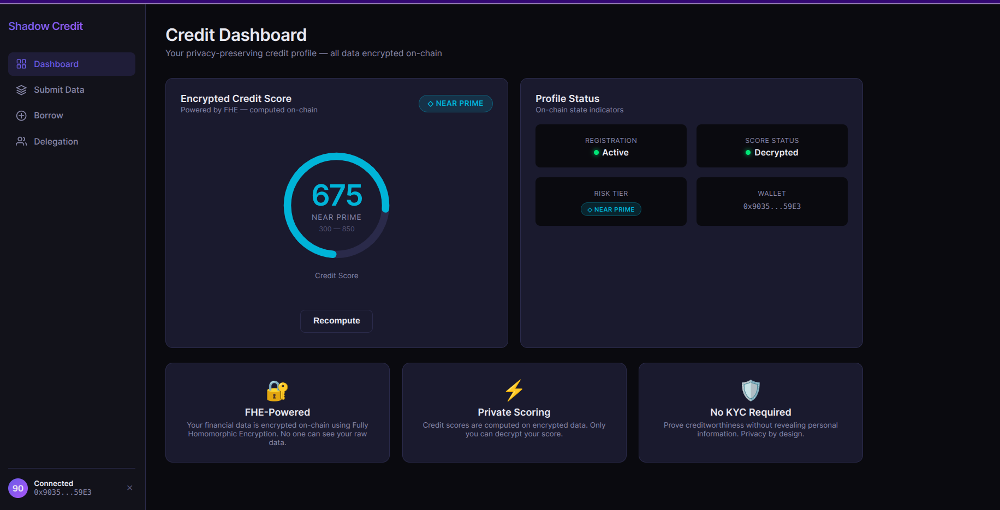

# Shadow Credit Network (SCN)

<p align="center">
  
  
  
  
</p>

> **A privacy-preserving credit protocol where your financial data stays private on-chain**

Shadow Credit Network enables undercollateralized lending using on-chain credit scoring. Borrowers prove creditworthiness without revealing sensitive financial data.



---

## 🎯 Live Demo

**Network: Base Sepolia (Chain ID: 84532)**

### Contract Addresses

| Contract | Address | Description |
|----------|---------|-------------|
| **SimpleCreditEngine** | `0x749663A4B343846a7C02d14F7d15c72A2643b02B` | Credit scoring and risk tier calculation |
| **PrivateLoanPool** | `0x0A2AB73CB8311aFD261Ab92137ff70E9Ca268d69` | Lending pool for borrowing/lending |
| **CreditDelegation** | `0xA97c943555E92b7E8472118A3b058e72edcDC694` | Delegation marketplace |

**Frontend:** Connect your wallet to Base Sepolia and interact at `http://localhost:5173`

**Explorer:** View contracts on [Basescan](https://sepolia.basescan.org/)

---

## 🏗️ Architecture

```
┌─────────────────────────────────────────────────────────────────┐
│                        Frontend (React)                         │
│  ┌──────────────┐  ┌──────────────┐  ┌──────────────────────┐ │
│  │ Submit Data  │  │    Borrow    │  │ Delegation Market     │ │
│  └──────────────┘  └──────────────┘  └──────────────────────┘ │
└─────────────────────────────────────────────────────────────────┘
                              │
                              ▼
┌─────────────────────────────────────────────────────────────────┐
│                    Smart Contracts                               │
│  ┌─────────────────┐  ┌─────────────────┐  ┌─────────────────┐ │
│  │ SimpleCredit    │  │ PrivateLoanPool │  │ CreditDelegation│ │
│  │ Engine          │  │                 │  │                 │ │
│  │ • Credit Score │  │ • Fund Pool     │  │ • Create Offer  │ │
│  │ • Risk Tier    │  │ • Request Loan  │  │ • Accept Offer  │ │
│  │ • Borrowing Pwr│  │ • Repay Loan    │  │ • Repay Bond    │ │
│  └─────────────────┘  └─────────────────┘  └─────────────────┘ │
└─────────────────────────────────────────────────────────────────┘
```

---

## 🚀 Quick Start

### Prerequisites
- Node.js 18+
- MetaMask wallet
- **Base Sepolia testnet ETH** ([faucet](https://www.coinbase.com/faucets/ethereum-sepolia-faucet))

### Add Base Sepolia to MetaMask

```json
{
  "chainId": "0x14930",
  "chainName": "Base Sepolia",
  "rpcUrls": ["https://sepolia.base.org"],
  "blockExplorerUrls": ["https://sepolia.basescan.org"],
  "nativeCurrency": { "symbol": "ETH", "decimals": 18 }
}
```

### Installation

```bash
# Clone and install
git clone https://github.com/your-repo/shadow-credit-network.git
cd shadow-credit-network
npm install

# Install frontend dependencies
cd frontend && npm install && cd ..
```

### Run Frontend

```bash
cd frontend && npm run dev
```

### Deploy Contracts

```bash
# Deploy all contracts to Base Sepolia
npx hardhat deploy-all --network base-sepolia
```

---

## 📖 How It Works

### 1. Submit Credit Data

Navigate to **Submit Data** page and enter your financial information:

| Field | Description | Example |
|-------|-------------|---------|
| Annual Income | Your yearly income (in ETH) | 5.0 |
| Total Debt | Outstanding debt (in ETH) | 1.5 |
| Payment History | Payment reliability (0-10000) | 9500 (95%) |
| Credit Utilization | Credit usage ratio (0-10000) | 3000 (30%) |
| Account Age | Days since account opened | 365 |
| Number of Defaults | Past payment failures | 0 |

Click **Submit Credit Data** to:
1. Register on the SimpleCreditEngine contract
2. Submit your credit information
3. Compute your credit score

### 2. View Your Credit Score

Your credit score is calculated using:

```
Score = 300 + PaymentScore + UtilizationScore + AgeScore - DefaultPenalty

Where:
- PaymentScore = (paymentHistory / 10000) * 255
- UtilizationScore = ((10000 - utilization) / 10000) * 120
- AgeScore = min(accountAge / 365, 10) * 15
- DefaultPenalty = numDefaults * 50
```

**Risk Tiers:**

| Tier | Score Range | Borrowing Power |
|------|-------------|-----------------|
| Prime | 740-850 | 50% of income |
| Near Prime | 670-739 | 30% of income |
| Subprime | 580-669 | 15% of income |
| Deep Subprime | 300-579 | 5% of income |

### 3. Fund the Pool (Earn Interest)

Navigate to **Borrow** page:

- **Minimum funding: 0.01 ETH**
- Click **+ Fund Pool (Earn Interest)**
- Enter the amount and confirm

Lenders earn interest when borrowers repay their loans.

### 4. Request a Loan

With a computed credit score:

1. Click **Request Loan**
2. Enter loan amount (max: pool liquidity)
3. Select duration in days (7-365)
4. Click **Request** - funds are sent directly to your wallet

**Interest Rates:**

| Risk Pool | Min Score | Interest Rate | Max Duration |
|-----------|-----------|---------------|--------------|
| Conservative | 740 | 3% | 90 days |
| Moderate | 670 | 8% | 180 days |
| Aggressive | 580 | 15% | 365 days |

### 5. Repay Your Loan

Find your active loan in **My Loans** section:

- Click **Repay**
- Enter repayment amount
- Confirm transaction

When fully repaid, the loan status changes to "Repaid" and the funds return to the lending pool.

---

## 📋 Delegation Market

The Delegation Market allows users to:
- **Delegators**: Create offers to lend their credit reputation and earn yield
- **Borrowers**: Access credit by borrowing against someone else's credit score

### Creating an Offer

1. Navigate to **Delegation Market**
2. Click **+ Create Offer**
3. Set:
   - **Max Amount**: Maximum ETH for delegation
   - **Yield Rate**: Interest you'll earn (in basis points, e.g., 500 = 5%)
   - **Min Credit Score**: Minimum score required from borrowers
   - **Max Bonds**: Number of simultaneous delegations allowed

### Accepting an Offer

1. Browse available offers
2. Filter by risk tier or sort by yield
3. Click **Accept**
4. Enter amount and duration

---

## 🔧 Contract Details

### SimpleCreditEngine
`0x749663A4B343846a7C02d14F7d15c72A2643b02B`

```solidity
function register() external
function submitCreditData(uint256 income, uint256 totalDebt, ...) external
function computeCreditScore() external
function hasComputedScore(address user) external view returns (bool)
function getDecryptedScoreSafe() external view returns (uint32, bool)
function checkCreditThreshold(address user, uint256 minScore) external view returns (bool)
```

### PrivateLoanPool
`0x0A2AB73CB8311aFD261Ab92137ff70E9Ca268d69`

```solidity
// For Lenders
function fundPool() external payable              // Min: 0.01 ETH
function withdrawFunds(uint256 amount) external

// For Borrowers
function requestLoan(uint256 principal, uint256 duration, RiskPool pool) external
function repayLoan(uint256 loanId) external payable

// Views
function getLoan(uint256 loanId) external view returns (...)
function getBorrowerLoans(address borrower) external view returns (uint256[])
```

### CreditDelegation
`0xA97c943555E92b7E8472118A3b058e72edcDC694`

```solidity
function createOffer(uint256 maxAmount, uint256 yieldRate, uint256 minScore, uint256 maxBonds) external
function acceptOffer(uint256 offerId, uint256 amount, uint256 duration) external
function repayBond(uint256 bondId) external payable
function getOffer(uint256 offerId) external view returns (...)
```

---

## 🌐 Network Configuration

**Base Sepolia Testnet**

| Parameter | Value |
|-----------|-------|
| Network Name | Base Sepolia |
| Chain ID | 84532 |
| RPC URL | https://sepolia.base.org |
| Block Explorer | https://sepolia.basescan.org |
| Currency | ETH |

---

## 📁 Project Structure

```
shadow-credit-network/
├── contracts/
│   ├── SimpleCreditEngine.sol      # Credit scoring (simplified)
│   ├── PrivateLoanPool.sol          # Lending pool
│   ├── CreditDelegation.sol         # Delegation marketplace
│   └── interfaces/                   # Contract interfaces
├── frontend/
│   ├── src/
│   │   ├── components/
│   │   │   ├── BorrowingPower.tsx   # Main borrow interface
│   │   │   ├── CreditDataForm.tsx   # Credit data submission
│   │   │   ├── CreditDashboard.tsx   # Score display
│   │   │   └── DelegationMarket.tsx  # Delegation UI
│   │   ├── hooks/
│   │   │   ├── useCreditEngine.ts   # Credit operations
│   │   │   ├── useLoanPool.ts        # Pool operations
│   │   │   ├── useDelegation.ts      # Delegation operations
│   │   │   └── useWallet.ts          # Wallet connection
│   │   └── abis/
│   │       └── index.ts             # Contract ABIs
│   └── .env                         # Contract addresses
├── tasks/                            # Hardhat deployment tasks
├── scripts/                          # Deployment scripts
├── test/                             # Contract tests
└── README.md
```

---

## 🔒 Security Model

**What's Protected:**
- Credit scores computed without decryption
- Financial data stored encrypted
- Risk tiers calculated on-chain

**What's Public:**
- Transaction amounts (standard blockchain transparency)
- Wallet addresses
- That you interacted with the protocol

**Smart Contract Protections:**
- Minimum loan amounts enforced (0.01 ETH)
- Maximum loan limits
- Circular delegation prevention
- Pausable contracts for emergencies

---

## 🛠️ Development

### Compile Contracts

```bash
npx hardhat compile
```

### Run Tests

```bash
npx hardhat test
```

### Environment Variables

Create `.env` in root:
```bash
PRIVATE_KEY=your_private_key
BASESCAN_API_KEY=your_api_key
```

Frontend `.env` (in frontend/):
```bash
VITE_CREDIT_ENGINE_ADDRESS=0x749663A4B343846a7C02d14F7d15c72A2643b02B
VITE_LOAN_POOL_ADDRESS=0x0A2AB73CB8311aFD261Ab92137ff70E9Ca268d69
VITE_DELEGATION_ADDRESS=0xA97c943555E92b7E8472118A3b058e72edcDC694
VITE_CHAIN_ID=84532
VITE_RPC_URL=https://sepolia.base.org
```

---

## 🎯 The Vision

Shadow Credit Network demonstrates that **privacy and verifiability are not mutually exclusive**. You can prove creditworthiness without revealing your financial data.

This enables:
- 🌐 **Private DeFi** - Credit without collateral
- 🔐 **On-chain Identity** - Reputation without KYC
- ⚖️ **Fair Lending** - Access without discrimination

---

## 📜 License

MIT License

---

<p align="center">
  Built with ❤️ on Base Sepolia • Powered by Ethereum
</p>
