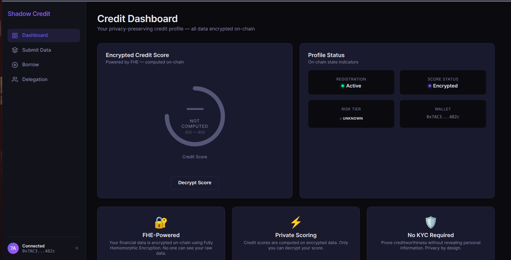

# Shadow Credit Network (SCN)

A privacy-preserving credit and lending protocol powered by Fully Homomorphic Encryption (FHE) using the Fhenix stack. No plaintext financial data is ever stored on-chain.

---
   
- Shadow Credit Network enables private, on-chain credit scoring using Fully Homomorphic Encryption, ensuring your financial data never appears in plaintext on the blockchain.
It unlocks undercollateralized lending based on encrypted creditworthiness, removing the need for excessive collateral that locks up capital.
Users can stake their reputation to delegate credit to others, creating new yield opportunities while maintaining privacy.
The protocol eliminates KYC requirements while still providing robust credit risk assessment through encrypted factors like payment history and utilization.
With ZK-proof verification, it guarantees input authenticity without exposing underlying data—bridging trust and privacy.
Borrowers gain access to fair credit without revealing sensitive financial histories to lenders or the public.
For the DeFi ecosystem, it introduces a privacy-preserving primitive that makes credit markets more inclusive, efficient, and capital-efficient—as foundational as oxygen is for breathing.


## Table of Contents

- [Overview](#overview)
- [Architecture](#architecture)
- [Smart Contracts](#smart-contracts)
- [Frontend](#frontend)
- [Dependencies](#dependencies)
- [Installation](#installation)
- [Configuration](#configuration)
- [Testing](#testing)
- [Deployment](#deployment)
- [API Reference](#api-reference)
- [Security](#security)

---

## Overview

Shadow Credit Network introduces **private on-chain credit** — a novel primitive that enables:

- **Encrypted credit scoring** using FHE (your data stays private on-chain)
- **Undercollateralized lending** based on encrypted creditworthiness
- **Credit delegation** where users can stake reputation for others to borrow against
- **ZK + FHE hybrid** verification for input authenticity
- **Reputation tracking** with multi-factor encrypted scores and attestations

No KYC. No plaintext financial data. Privacy by design.

---

## Architecture

```
┌──────────────────────────────────────────────────────────────────┐
│                        Shadow Credit Network                     │
├──────────────────────────────────────────────────────────────────┤
│                                                                  │
│  ┌─────────────────────┐    ┌──────────────────────────────────┐ │
│  │  EncryptedCredit     │    │  ReputationRegistry              │ │
│  │  Engine              │◄──►│  (6 encrypted factors +          │ │
│  │  (FHE scoring,       │    │   attestations + decay)          │ │
│  │   delegation)        │    └──────────────────────────────────┘ │
│  └─────────┬───────────┘                                         │
│            │                                                      │
│  ┌─────────▼───────────┐    ┌──────────────────────────────────┐ │
│  │  PrivateLoanPool     │    │  CreditDelegation                │ │
│  │  (3 risk tiers,      │    │  (Marketplace, yield,            │ │
│  │   encrypted terms)   │    │   anti-Sybil, circular check)    │ │
│  └─────────┬───────────┘    └──────────────────────────────────┘ │
│            │                                                      │
│  ┌─────────▼───────────┐    ┌──────────────────────────────────┐ │
│  │  CreditDataWithZK    │───►│  Groth16Verifier                 │ │
│  │  (ZK→FHE bridge)     │    │  (BN256 on-chain verification)   │ │
│  └─────────────────────┘    └──────────────────────────────────┘ │
│                                                                  │
├──────────────────────────────────────────────────────────────────┤
│  Frontend (React + Vite)                                         │
│  Dashboard │ Submit Data │ Borrow │ Delegation Market            │
└──────────────────────────────────────────────────────────────────┘
```

### Data Flow

```
User (off-chain)                     On-chain (encrypted)
─────────────────                    ─────────────────────
1. Collect financial data
2. Generate ZK proof (circom)  ──►  Groth16Verifier.verify()
3. Encrypt via Cofhe SDK       ──►  CreditDataWithZK.submitWithProof()
4. Contract verifies proof
5. Forwards encrypted data     ──►  EncryptedCreditEngine.submitCreditData()
6. FHE computation             ──►  computeCreditScore() [all encrypted]
7. Request decryption          ──►  requestScoreDecryption()
8. Read decrypted result       ◄──  getDecryptedScoreSafe()
```

---

## Smart Contracts

### Module 1: EncryptedCreditEngine

**File:** `contracts/EncryptedCreditEngine.sol` (563 lines)

The core FHE credit scoring engine. All financial data is encrypted using `euint32`, `euint64`, and `euint8` types from `@fhenixprotocol/cofhe-contracts`.

| Function | Description |
|----------|-------------|
| `register()` | Register as a user on-chain |
| `submitCreditData(...)` | Submit 6 encrypted financial fields |
| `computeCreditScore()` | FHE score: 300 base + payment + utilization + age - defaults → [300, 850] |
| `computeBorrowingPower()` | income × riskFactor(%) − debt, gated by min score |
| `requestScoreDecryption()` | Decrypt your score (owner-only via `FHE.decrypt`) |
| `authorizeDelegate(addr, limit)` | Grant delegated credit |
| `revokeDelegate(addr)` | Revoke delegation |

**Risk Tiers** (computed on encrypted data):
| Tier | Score Range | Borrowing Factor |
|------|------------|-----------------|
| Prime | 740–850 | 50% of income |
| Near Prime | 670–739 | 30% of income |
| Subprime | 580–669 | 15% of income |
| Deep Subprime | 300–579 | 5% of income |

---

### Module 2: ReputationRegistry

**File:** `contracts/ReputationRegistry.sol` (580 lines)

Multi-factor encrypted reputation system with attestation support.

| Factor | Weight | Description |
|--------|--------|-------------|
| TransactionReliability | 30% | On-time payments, successful txns |
| StakingHistory | 20% | Duration and amount staked |
| GovernanceParticipation | 15% | Voting, proposals |
| ProtocolInteraction | 15% | Depth of protocol usage |
| SocialVerification | 10% | KYC/social attestations |
| DefaultHistory | 10% | Inverse: lower defaults = better |

**Features:**
- Attestation system (verified partners issue encrypted attestations)
- Time-based decay (reputation decreases over inactivity)
- Integration contract authorization (CreditEngine can update factors)
- Composite score = weighted sum + attestation bonus (+5% per attestation, max +25%)

---

### Module 3: PrivateLoanPool

**File:** `contracts/PrivateLoanPool.sol` (617 lines)

Undercollateralized lending pool with 3 risk tiers.

| Pool | Max LTV | Base Rate | Max Duration | Min Score |
|------|---------|-----------|-------------|-----------|
| Conservative | 30% | 3% | 90 days | 740 |
| Moderate | 50% | 8% | 180 days | 670 |
| Aggressive | 75% | 15% | 365 days | 580 |

**Lifecycle:**
```
fundPool() → requestLoan() → approveLoan() → repayLoan() → markRepaid()
                                            → markDefaulted() → liquidateLoan()
```

---

### Module 4: CreditDelegation

**File:** `contracts/CreditDelegation.sol` (587 lines)

Delegation marketplace enabling delegators to earn yield by staking credit reputation.

**Security:**
- Circular delegation prevention (A→B→A chains blocked)
- Self-delegation blocked
- Sybil protection (interaction count capped per borrower)
- Blacklist system for abusive borrowers
- Default penalty propagation to delegators

**Lifecycle:**
```
createOffer() → acceptOffer() → recordBorrowed() → recordRepayment() → markBondRepaid()
                                                      → markBondDefaulted() (penalty applied)
```

---

### Module 5: ZK Verifier Integration

**Files:**
- `contracts/interfaces/IZKVerifier.sol` — Interface for pluggable proof systems
- `contracts/Groth16Verifier.sol` — On-chain BN256 pairing verification
- `contracts/CreditDataWithZK.sol` — ZK→FHE bridge contract

**Hybrid ZK+FHE Flow:**
1. User generates Groth16 proof off-chain (validates input ranges)
2. User encrypts data via Cofhe SDK
3. `CreditDataWithZK.submitWithProof()` verifies proof then forwards to `EncryptedCreditEngine`
4. FHE computation executes on verified encrypted data

---

## Frontend

### Tech Stack

| Technology | Purpose |
|-----------|---------|
| React 18 | UI framework |
| Vite 8 | Build tool + dev server |
| TypeScript | Type safety |
| react-router-dom 6 | Client-side routing |
| ethers.js 6 | Ethereum interaction |
| lucide-react | Icons |

### Pages

| Route | Component | Description |
|-------|-----------|-------------|
| `/` | `CreditDashboard` | Score gauge, profile status, onboarding |
| `/submit` | `CreditDataForm` | Encrypted data submission with live preview |
| `/borrow` | `BorrowingPower` | Borrowing capacity with tier breakdown |
| `/delegation` | `DelegationMarket` | Trading-terminal delegation marketplace |

### Key Components

| Component | Description |
|-----------|-------------|
| `ScoreGauge` | Animated ring gauge with color-coded tiers |
| `RiskBadge` | Prime / Near Prime / Subprime / Deep Subprime badges |
| `TxFeedback` | Real-time tx state: Loading → Encrypted → Success |
| `CreditDataForm` | Range sliders + live FHE encryption preview |
| `DelegationMarket` | Sortable/filterable table with yield projections |

---

## Dependencies

### Backend (Smart Contracts)

| Package | Version | Purpose |
|---------|---------|---------|
| `@fhenixprotocol/cofhe-contracts` | ^0.0.13 | FHE primitives (euint types, FHE library) |
| `@fhenixprotocol/cofhe-mock-contracts` | ^0.3.1 | Mock FHE contracts for local testing |
| `@openzeppelin/contracts` | ^5.0.0 | Ownable, access control |
| `@openzeppelin/contracts-upgradeable` | ^5.0.0 | Upgradeable contract patterns |
| `cofhe-hardhat-plugin` | ^0.3.1 | Hardhat integration for Fhenix |
| `cofhejs` | ^0.3.1 | Client-side FHE encryption/decryption |
| `hardhat` | ^2.22.19 | Ethereum development framework |
| `@nomicfoundation/hardhat-toolbox` | ^5.0.0 | Hardhat plugin bundle |
| `@nomicfoundation/hardhat-ethers` | ^3.0.0 | Ethers.js integration |
| `@nomicfoundation/hardhat-ignition` | ^0.15.0 | Deployment management |
| `@nomicfoundation/hardhat-verify` | ^2.0.0 | Block explorer verification |
| `@nomicfoundation/hardhat-chai-matchers` | ^2.0.0 | Test matchers |
| `@nomicfoundation/hardhat-network-helpers` | ^1.0.0 | Time manipulation, snapshots |
| `@typechain/ethers-v6` | ^0.5.0 | TypeScript bindings |
| `@typechain/hardhat` | ^9.0.0 | Hardhat TypeChain integration |
| `typechain` | ^8.3.0 | Contract type generation |
| `ethers` | ^6.4.0 | Ethereum library |
| `chai` | ^4.2.0 | Test assertions |
| `dotenv` | ^16.4.7 | Environment variable loading |
| `typescript` | >=4.5.0 | TypeScript compiler |
| `ts-node` | >=8.0.0 | TypeScript execution |
| `hardhat-gas-reporter` | ^1.0.8 | Gas usage reporting |
| `solidity-coverage` | ^0.8.0 | Test coverage |

### Frontend

| Package | Version | Purpose |
|---------|---------|---------|
| `react` | ^18.3.1 | UI framework |
| `react-dom` | ^18.3.1 | React DOM renderer |
| `react-router-dom` | ^6.30.3 | Client-side routing |
| `ethers` | ^6.16.0 | Ethereum interaction |
| `lucide-react` | ^1.7.0 | Icon library |
| `vite` | ^8.0.3 | Build tool |
| `@vitejs/plugin-react` | ^6.0.1 | React Vite plugin |
| `typescript` | ^6.0.2 | TypeScript compiler |
| `@types/react` | ^19.2.14 | React type definitions |
| `@types/react-dom` | ^19.2.3 | ReactDOM type definitions |

---

## Installation

### Prerequisites

- **Node.js** >= 18.0.0
- **npm** >= 9.0.0
- **Docker** (optional, for local Fhenix node)

### 1. Clone & Install

```bash
git clone https://github.com/your-org/shadow-credit-network.git
cd shadow-credit-network

# Install contract dependencies
npm install

# Install frontend dependencies
cd frontend
npm install
cd ..
```

### 2. Compile Contracts

```bash
npx hardhat compile
```

### 3. Run Tests

```bash
# Run all tests (default: hardhat network with mocks)
npx hardhat test

# Run specific module tests
npx hardhat test test/EncryptedCreditEngine.test.ts
npx hardhat test test/ReputationRegistry.test.ts
npx hardhat test test/PrivateLoanPool.test.ts
npx hardhat test test/CreditDelegation.test.ts
npx hardhat test test/ZKVerifier.test.ts
```

### 4. Start Frontend

```bash
cd frontend
npm run dev
# Opens at http://localhost:3000
```

---

## Configuration

### Environment Variables

Create a `.env` file in the project root:

```bash
# Deployer private key (without 0x prefix)
PRIVATE_KEY=your_private_key_here

# RPC URLs
SEPOLIA_RPC_URL=https://ethereum-sepolia.publicnode.com
ARBITRUM_SEPOLIA_RPC_URL=https://sepolia-rollup.arbitrum.io/rpc
BASE_SEPOLIA_RPC_URL=https://sepolia.base.org

# Block Explorer API Keys (for verification)
ETHERSCAN_API_KEY=
ARBISCAN_API_KEY=
BASESCAN_API_KEY=

# Gas Reporter
REPORT_GAS=false
```

### Frontend Environment Variables

Create a `.env` file in the `frontend/` directory:

```bash
VITE_CREDIT_ENGINE_ADDRESS=0x...
VITE_LOAN_POOL_ADDRESS=0x...
VITE_DELEGATION_ADDRESS=0x...
VITE_REPUTATION_ADDRESS=0x...
```

---

## Testing

### Test Suite Overview

| Module | Test File | Tests | Coverage |
|--------|-----------|-------|----------|
| EncryptedCreditEngine | `test/EncryptedCreditEngine.test.ts` | 29 | Registration, data submission, score computation, decryption, delegation |
| ReputationRegistry | `test/ReputationRegistry.test.ts` | 37 | Factors, attestations, decay, verifiers, composite scoring |
| PrivateLoanPool | `test/PrivateLoanPool.test.ts` | 42 | Funding, loans, approval, repayment, default, liquidation |
| CreditDelegation | `test/CreditDelegation.test.ts` | 40 | Offers, bonds, circular check, Sybil, blacklisting, yield |
| ZKVerifier | `test/ZKVerifier.test.ts` | 18 | VK management, proof system type, bridge integration |
| **Total** | | **166** | |

### Test Commands

```bash
# Run all tests
npx hardhat test

# Run with gas reporting
REPORT_GAS=true npx hardhat test

# Run specific test file
npx hardhat test test/EncryptedCreditEngine.test.ts

# Run on local Fhenix node (requires Docker)
npm run localcofhe:test
```

### Testing Notes

- All FHE tests use the cofhe-hardhat-plugin mock environment
- Tests use `cofhejs.encrypt()` for creating encrypted inputs
- FHE operations in mocks report higher gas due to simulation overhead
- The mocha timeout is set to 100 seconds for FHE-heavy tests

---

## Deployment

### Supported Networks

| Network | Chain ID | RPC |
|---------|----------|-----|
| Fhenix Sepolia | 80069 | Built-in |
| Ethereum Sepolia | 11155111 | `SEPOLIA_RPC_URL` |
| Arbitrum Sepolia | 421614 | `ARBITRUM_SEPOLIA_RPC_URL` |
| Base Sepolia | 84532 | `BASE_SEPOLIA_RPC_URL` |

### Deploy All Contracts

```bash
# 1. Deploy EncryptedCreditEngine
npx hardhat deploy-credit-engine --network eth-sepolia

# 2. Deploy ReputationRegistry (links to CreditEngine)
npx hardhat deploy-reputation-registry --network eth-sepolia

# 3. Deploy PrivateLoanPool (links to CreditEngine)
npx hardhat deploy-loan-pool --network eth-sepolia

# 4. Deploy CreditDelegation
npx hardhat deploy-credit-delegation --network eth-sepolia

# 5. Deploy ZK Verifier stack
npx hardhat deploy-zk-verifier --network eth-sepolia
```

### Deploy with Ignition

```bash
npx hardhat ignition deploy ignition/modules/EncryptedCreditEngine.ts --network eth-sepolia
```

### Verify Contracts

Verification is automatic during deployment. To verify manually:

```bash
npx hardhat verify --network eth-sepolia DEPLOYED_ADDRESS "constructor_arg"
```

---

## API Reference

### EncryptedCreditEngine

```solidity
// Registration
function register() external
function isRegistered(address user) external view returns (bool)

// Credit Data (all inputs are encrypted)
function submitCreditData(
    InEuint64 calldata income,
    InEuint64 calldata totalDebt,
    InEuint32 calldata paymentHistory,    // 0-10000 basis points
    InEuint32 calldata creditUtilization, // 0-10000 basis points
    InEuint32 calldata accountAge,        // days
    InEuint32 calldata numDefaults
) external

// Scoring
function computeCreditScore() external
function computeBorrowingPower() external
function hasComputedScore(address user) external view returns (bool)

// Decryption (owner-only)
function requestScoreDecryption() external
function getDecryptedScoreSafe() external view returns (uint32 score, bool isDecrypted)

// Delegation
function authorizeDelegate(address delegate, InEuint64 calldata creditLimit) external
function revokeDelegate(address delegate) external
function isDelegationActive(address delegator, address delegate) external view returns (bool)
```

### PrivateLoanPool

```solidity
// Lending
function fundPool() external payable
function withdrawFunds(uint256 amount) external
function getAvailableLiquidity() external view returns (uint256)

// Borrowing
function requestLoan(InEuint64 calldata principal, InEuint32 calldata duration, RiskPool pool) external
function repayLoan(uint256 loanId) external payable
function getLoanStatus(uint256 loanId) external view returns (LoanStatus)

// Admin
function approveLoan(uint256 loanId, uint256 disbursementAmount) external payable
function markRepaid(uint256 loanId) external
function markDefaulted(uint256 loanId) external
```

### CreditDelegation

```solidity
// Offers
function createOffer(InEuint64 maxAmount, InEuint32 yieldRate, InEuint32 minCreditScore, uint256 maxBonds) external
function cancelOffer(uint256 offerId) external

// Bonds
function acceptOffer(uint256 offerId, InEuint64 amount, InEuint32 duration) external
function recordRepayment(uint256 bondId) external payable
function getBond(uint256 bondId) external view returns (...)

// Security
function blacklistBorrower(address borrower) external
function markBondDefaulted(uint256 bondId) external
```

---

## Security

### FHE Security Properties

- **Data Confidentiality**: All financial data is encrypted on-chain using Fhenix FHE primitives
- **Computation Privacy**: Credit scores are computed on encrypted data without decryption
- **Permissioned Decryption**: Only the data owner can request decryption of their own scores
- **No Side-Channel Leakage**: Logic branches use `FHE.select` to prevent timing attacks

### Smart Contract Security

- **Access Control**: `Ownable` pattern for admin functions, `onlyRegistered` for user functions
- **Anti-Sybil**: Interaction count limits per borrower address
- **Circular Delegation Prevention**: Bidirectional bond checking prevents A→B→A loops
- **Replay Protection**: Nonce-based anti-replay in ZK proof submissions
- **Underflow Protection**: `FHE.select` for encrypted conditional operations

### Known Limitations

- FHE operations are gas-intensive (5-10x normal operations)
- Mock testing environment reports inflated gas costs
- Score decryption is asynchronous (requires callback)
- ZK proof verification requires circom/snarkjs toolchain for proof generation

---

## Project Structure

```
shadow-credit-network/
├── contracts/
│   ├── EncryptedCreditEngine.sol       FHE credit scoring engine
│   ├── ReputationRegistry.sol          Encrypted reputation + attestations
│   ├── PrivateLoanPool.sol             Undercollateralized lending pool
│   ├── CreditDelegation.sol            Delegation marketplace
│   ├── Groth16Verifier.sol             On-chain ZK proof verification
│   ├── CreditDataWithZK.sol            ZK→FHE bridge
│   └── interfaces/
│       └── IZKVerifier.sol             Verifier interface
├── test/
│   ├── EncryptedCreditEngine.test.ts   29 tests
│   ├── ReputationRegistry.test.ts      37 tests
│   ├── PrivateLoanPool.test.ts         42 tests
│   ├── CreditDelegation.test.ts        40 tests
│   └── ZKVerifier.test.ts             18 tests
├── tasks/
│   ├── deploy-credit-engine.ts
│   ├── deploy-reputation-registry.ts
│   ├── deploy-loan-pool.ts
│   ├── deploy-credit-delegation.ts
│   └── deploy-zk-verifier.ts
├── ignition/modules/
│   ├── EncryptedCreditEngine.ts
│   ├── ReputationRegistry.ts
│   ├── PrivateLoanPool.ts
│   └── CreditDelegation.ts
├── frontend/
│   ├── src/
│   │   ├── App.tsx                     Router + wallet connection
│   │   ├── abis/index.ts              Contract ABIs
│   │   ├── hooks/
│   │   │   ├── useWallet.ts            MetaMask hook
│   │   │   └── useCreditEngine.ts      Credit engine hook
│   │   ├── components/
│   │   │   ├── CreditDashboard.tsx     Score dashboard
│   │   │   ├── ScoreGauge.tsx          Gamified ring gauge
│   │   │   ├── RiskBadge.tsx           Tier badges
│   │   │   ├── TxFeedback.tsx          Transaction state
│   │   │   ├── CreditDataForm.tsx      Data submission
│   │   │   ├── DelegationMarket.tsx    Market terminal
│   │   │   └── BorrowingPower.tsx      Borrowing dashboard
│   │   └── styles/global.css           Dark theme CSS
│   ├── package.json
│   └── vite.config.ts
├── hardhat.config.ts                   Network configs + plugins
├── package.json                        Backend dependencies
├── .env.example                        Environment template
└── README.md                           This file
```

---

## License

MIT
