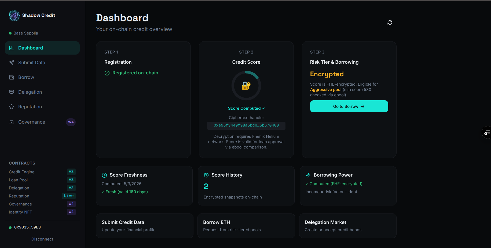

# Shadow Credit Network

> **Privacy-preserving undercollateralized lending on Arbitrum Sepolia.**
> Your credit score is computed on encrypted data. No plaintext ever touches the chain.
> CoFHE live on Arbitrum — every FHE operation works in production.

---



## Live System — Wave 5 Deployed (Bridge WIP)

**Primary Network:** Arbitrum Sepolia (Chain ID: 421614) — CoFHE enabled  
**Legacy:** Base Sepolia (Chain ID: 84532) — Wave 1–3 reference

### Wave 3–5 — Arbitrum Sepolia (Live, CoFHE Enabled)
| Contract | Address | Explorer |
|---|---|---|
| `ReputationRegistry` | `0x285661cff3A6E6f80184Cc3bb10b87c38643b2ad` | [View](https://sepolia.arbiscan.io/address/0x285661cff3A6E6f80184Cc3bb10b87c38643b2ad) |
| `EncryptedCreditEngineV3` | `0xaaF38A665e74EdE56a7549B193e007B3976eF184` | [View](https://sepolia.arbiscan.io/address/0xaaF38A665e74EdE56a7549B193e007B3976eF184) |
| `PrivateLoanPoolV3` | `0xC6360360cCF32bE622723e576D8bDA9fc3446F43` | [View](https://sepolia.arbiscan.io/address/0xC6360360cCF32bE622723e576D8bDA9fc3446F43) |
| `CreditDelegationV2` | `0x06B17Bac6fDFc018FD2c831431751a9808CBa5a5` | [View](https://sepolia.arbiscan.io/address/0x06B17Bac6fDFc018FD2c831431751a9808CBa5a5) |
| `CreditDataWithZK` | `0x5695FBc56e42Fb8b99612DA612eb984Bb58D7c37` | [View](https://sepolia.arbiscan.io/address/0x5695FBc56e42Fb8b99612DA612eb984Bb58D7c37) |
| `ScoreGatedGovernance` | `0x68A0d6d7329B7f7Bffd74f2481f6DDD70aF16971` | [View](https://sepolia.arbiscan.io/address/0x68A0d6d7329B7f7Bffd74f2481f6DDD70aF16971) |
| `SoulboundCreditNFT` | `0x72fbfBD6260A543CF29ea7e2a175E7b4C482D7b6` | [View](https://sepolia.arbiscan.io/address/0x72fbfBD6260A543CF29ea7e2a175E7b4C482D7b6) |
| `MultiAssetLoanPool` | `0x384B2460d7AC08Cef74B02E4D80108aDCa4B4A12` | [View](https://sepolia.arbiscan.io/address/0x384B2460d7AC08Cef74B02E4D80108aDCa4B4A12) |
| `CrossChainCreditBridge` | `0xB95C4EeA0072f49a1166835E229Eef6aa7b02125` | [View](https://sepolia.arbiscan.io/address/0xB95C4EeA0072f49a1166835E229Eef6aa7b02125) |

**Test Tokens (public `mint()` — faucet available in the UI):**
| Token | Address | Explorer | Mint |
|---|---|---|---|
| MockUSDC (6 dec) | `0x491ECb099a7E96d480256C2368620Cb5025CccCc` | [View](https://sepolia.arbiscan.io/address/0x491ECb099a7E96d480256C2368620Cb5025CccCc) | `mint(addr, 1000000)` |
| MockWETH (18 dec) | `0xDc44218E093f4E1959d7232550dBC56F6F76342E` | [View](https://sepolia.arbiscan.io/address/0xDc44218E093f4E1959d7232550dBC56F6F76342E) | `mint(addr, 1e18)` |
| MockDAI (18 dec) | `0xe53179158d4E5221703dEf34903E04FBd98DF7f7` | [View](https://sepolia.arbiscan.io/address/0xe53179158d4E5221703dEf34903E04FBd98DF7f7) | `mint(addr, 1e21)` |

**Pre-whitelisted on MultiAssetLoanPool** — prices set: USDC=$1.00, WETH=$3,500.00, DAI=$1.00.  
**Faucet included in frontend** — Multi-Asset Pool page shows "Test Token Faucet" buttons (Mint 1000 USDC / 1 WETH / 1000 DAI). Any wallet can call `mint()` directly.

### Wave 3–4 — Base Sepolia (Legacy Reference)
| Contract | Address | Explorer |
|---|---|---|
| `EncryptedCreditEngineV3` | `0x5A03628A15674c425606e0D4710D66EBa8da09E6` | [View](https://sepolia.basescan.org/address/0x5A03628A15674c425606e0D4710D66EBa8da09E6) |
| `PrivateLoanPoolV3` | `0x9227C5cC17A2C92fb44DB633C3327CF5E1246913` | [View](https://sepolia.basescan.org/address/0x9227C5cC17A2C92fb44DB633C3327CF5E1246913) |
| `CreditDelegationV2` | `0xB60cA6232CD26CC74C5605C35E9EbecF4C882348` | [View](https://sepolia.basescan.org/address/0xB60cA6232CD26CC74C5605C35E9EbecF4C882348) |
| `ReputationRegistry` | `0xeecAb683D93a483669D797E4B7a06e8c286A25dC` | [View](https://sepolia.basescan.org/address/0xeecAb683D93a483669D797E4B7a06e8c286A25dC) |
| `CreditDataWithZK` | `0xA464874091e2F16838746f41F2c5781dc01AEb51` | [View](https://sepolia.basescan.org/address/0xA464874091e2F16838746f41F2c5781dc01AEb51) |
| `ScoreGatedGovernance` | `0x43bF2ac1909dFbBa952EDfd4aE119C9B37E882Fd` | [View](https://sepolia.basescan.org/address/0x43bF2ac1909dFbBa952EDfd4aE119C9B37E882Fd) |
| `SoulboundCreditNFT` | `0x3494c525094bc9907443ad9D4311Cd87E76352F8` | [View](https://sepolia.basescan.org/address/0x3494c525094bc9907443ad9D4311Cd87E76352F8) |

### Wave 1 Reference (Base Sepolia)
| Contract | Address | Explorer |
|---|---|---|
| `SimpleCreditEngine` | `0x749663A4B343846a7C02d14F7d15c72A2643b02B` | [View](https://sepolia.basescan.org/address/0x749663A4B343846a7C02d14F7d15c72A2643b02B) |
| `PrivateLoanPool` | `0x0A2AB73CB8311aFD261Ab92137ff70E9Ca268d69` | [View](https://sepolia.basescan.org/address/0x0A2AB73CB8311aFD261Ab92137ff70E9Ca268d69) |
| `CreditDelegation` | `0xA97c943555E92b7E8472118A3b058e72edcDC694` | [View](https://sepolia.basescan.org/address/0xA97c943555E92b7E8472118A3b058e72edcDC694) |

**Deployer:** `0x90356CF97B3BF1749A604d3F89b3DF3602A459E3`  
**Arbitrum Sepolia deployment:** 2026-06-01 · **Mock tokens + whitelist:** 2026-06-01 · **Base Sepolia legacy:** 2026-05-03

```bash
# Verify any contract in 30 seconds
cast call 0xAA8e06Eaf2D92F0A3F1DA7b99edbB81A1a84B6A1 \
  "getUserCount()(uint256)" \
  --rpc-url https://sepolia-rollup.arbitrum.io/rpc
```

---

## The Problem

DeFi lending today requires overcollateralization — you must lock up more than you borrow. This excludes the majority of real-world borrowers who have creditworthiness but not idle capital. Traditional credit scoring solves this, but it requires revealing sensitive financial data.

**Shadow Credit Network solves both problems simultaneously:**
- Undercollateralized lending based on on-chain credit scores
- All financial data encrypted using Fully Homomorphic Encryption (FHE)
- No plaintext income, debt, or payment history ever stored on-chain
- Credit scores computed entirely in the encrypted domain

---

## What Shadow Credit Solves

| Problem | Traditional DeFi | Shadow Credit |
|---|---|---|
| Overcollateralization | Requires 150%+ collateral | Credit-based, no collateral needed |
| Financial privacy | All data public on-chain | All data FHE-encrypted |
| Credit identity | No portable credit history | On-chain encrypted score + history |
| Loan approval | Instant but blind | FHE ebool-gated, cryptographically verified |
| Yield for lenders | Fixed pool rates | Proportional yield from interest |
| Reputation | No protocol memory | 6-factor encrypted reputation registry |
| Score freshness | Stale data accepted | 180-day expiry enforced on-chain |
| Delegation | Yield accumulates, never paid | Yield transfers to delegator on repayment |

---

## Why Shadow Credit Wins

| Dimension | Competitors | Shadow Credit |
|---|---|---|
| **Privacy model** | Plaintext on-chain or off-chain trust | FHE — computed on ciphertext, no trusted party |
| **Loan approval** | Owner bool or oracle | `ebool` from `FHE.gte(score, threshold)` — cryptographic proof |
| **Score computation** | Off-chain, centralized | Fully on-chain in encrypted domain |
| **Data submission** | Plaintext or ZK range proofs only | ZK range proofs + FHE encryption (hybrid) |
| **Reputation** | None | 6-factor weighted, FHE-encrypted, auto-updated |
| **Lender yield** | Pool APY, no per-lender tracking | Proportional distribution per repayment |
| **Score history** | None | Ciphertext handles stored on-chain, provable trajectory |
| **Composability** | Siloed | `grantScoreAccess()` — any authorized protocol can read encrypted score |
| **Delegation** | Not available | Full lifecycle: create offer → accept bond → repay → yield paid |

---

## Who It's For

**Borrowers** who have on-chain financial history but no idle collateral. Submit encrypted income, debt, and payment data. Get a credit score (300–850) computed in the FHE domain. Borrow from risk-tiered pools without revealing a single number.

**Lenders** who want yield on idle ETH. Fund the pool, earn proportional interest as borrowers repay. Claim accrued yield at any time. No lock-up period.

**Delegators** who want to monetize their credit reputation. Create delegation offers with a yield rate and minimum score requirement. Borrowers accept bonds; yield transfers directly to the delegator on each repayment.

**Protocol integrators** who need a privacy-preserving credit primitive. Call `grantScoreAccess(yourContract)` to read a user's encrypted score handle. Build lending, insurance, or identity products on top.

---

## Security — Core Innovation

The four invariants that make Shadow Credit trustworthy:

### 1. ETH never moves without a verified FHE result

```solidity
// PrivateLoanPoolV3.resolveLoanApproval()
(bool ready, bool approved) = creditEngine.resolveApprovalCheck(loan.approvalCheckId);
if (!ready) return;  // FHE decryption not complete — retry later
if (approved) {
    _activateAndDisburse(_loanId);  // only path to ETH transfer
}
// No owner override. No plaintext bool bypass.
```

The `approvalCheckId` maps to an `ebool` created by `FHE.gte(encCreditScore, threshold)`. The ebool is decrypted asynchronously by the FHE network. `_disburseLoan()` is only reachable through `_activateAndDisburse()`, which is only reachable when `approved == true`.

### 2. No plaintext financial data on-chain — ever

```solidity
// EncryptedCreditEngineV3.submitCreditData()
// Each InEuint* carries a ZK proof of knowledge from the CoFHE SDK.
// FHE.asEuint*(InEuint*) verifies the proof and registers the ciphertext.
encIncome[msg.sender] = FHE.asEuint64(_income);
// income is now a ciphertext handle — unreadable without the user's key
```

**Plaintext never exists on-chain.** Not at rest, not in transit, not during computation:

| Stage | On-chain state | Can anyone read it? |
|---|---|---|
| Storage | `euint32` / `euint64` ciphertext handle | No — encrypted FHE ciphertext |
| FHE computation | All arithmetic on ciphertexts (`FHE.add`, `FHE.mul`, `FHE.select`, ...) | No — operates on ciphertext only |
| Score retrieval | `getMyScoreHandle()` returns a handle reference | No — just a pointer to ciphertext |
| Client-side decrypt | No on-chain transaction | N/A — happens in browser via `@cofhe/sdk` |
| Decryption result | **Never stored on-chain** | Yes — only in your browser tab, unsealed locally |

The CoFHE threshold network receives the handle + your permit -> **seals** (re-encrypts) the value with your public key. Your browser **unseals** it locally using your private key. The threshold network never sees plaintext — it only re-encrypts. The plaintext exists in exactly one place: your browser tab, after unsealing.

### 3. Score freshness enforced on-chain

```solidity
// EncryptedCreditEngineV3.requestApprovalCheck()
if (block.timestamp - scoreComputedAt[user] > scoreValidityPeriod) {
    revert StaleScore();  // 180-day default, owner-configurable
}
```

Stale scores cannot be used to obtain loans. Borrowers must resubmit data and recompute.

### 4. Reputation updates are automatic and tamper-resistant

```solidity
// PrivateLoanPoolV3.repayLoan() — on full repayment
_notifyReputation(msg.sender, true);
// Calls ReputationRegistry.notifyActivity() via authorized integration contract
// Updates ProtocolInteraction factor — no user action required
```

---

## Full Protocol Flow

```
User
 │
 ├─ register()                    → creates on-chain identity
 │
 ├─ submitCreditData(             → 6 FHE ciphertexts from CoFHE SDK
 │    InEuint64 income,           → ZK proof verifies range validity
 │    InEuint64 totalDebt,        → FHE.asEuint64() registers with ACL
 │    InEuint32 paymentHistory,
 │    InEuint32 creditUtilization,
 │    InEuint32 accountAge,
 │    InEuint32 numDefaults
 │  )
 │
 ├─ computeCreditScore()          → all arithmetic in FHE domain
 │    score = clamp(              → no plaintext intermediate values
 │      300 + paymentScore        → result: euint32 ciphertext handle
 │          + utilScore
 │          + ageScore
 │          - penalty,
 │      300, 850
 │    )
 │    → appends ctHash to scoreHistory[]
 │    → calls ReputationRegistry.notifyActivity()
 │
 ├─ requestScoreDecryption()      → FHE.decrypt(encCreditScore)
 │    → async: FHE network decrypts          [Fhenix Helium / localcofhe only]
 │    → poll getDecryptedScore() until isDecrypted == true
 │
 ├─ requestLoan(principal,        → PrivateLoanPoolV3
 │    duration, riskPool)         → calls requestApprovalCheck()
 │                                → FHE.gte(score, threshold) → ebool
 │                                → FHE.decrypt(ebool) async
 │                                [Fhenix Helium / localcofhe only]
 │
 ├─ resolveLoanApproval(loanId)   → polls FHE.getDecryptResultSafe(ebool)
 │    → if approved: _disburseLoan()   → ETH sent to borrower
 │    → if rejected: loan stays Pending
 │
 └─ repayLoan(loanId)             → interest distributed to lenders
      → lenderYieldEarned[lender] += share
      → ReputationRegistry.notifyActivity(borrower)
```

---

## Score-Gated Governance Lifecycle

Shadow Credit features a fully on-chain, score-gated DAO where voting power scales directly with a user's credit tier.

1. **Propose**: A user with a score `≥ 670` (Near Prime or higher) creates a proposal.
2. **Voting Period**: The voting window opens immediately and stays open for exactly **7 days**. Users cast votes, with weight scaled by their credit tier (Prime = 4×, Near Prime = 3×, Subprime = 2×, Deep Subprime = 1×).
3. **Finalize**: Once the 7-day window expires, the original proposer clicks **Finalize**. The contract verifies quorum and tallies the votes. If successful, the proposal state becomes `Passed`.
4. **Queue**: The passed proposal is pushed to the timelock queue.
5. **Execute**: After the **2-day execution delay** expires, the proposal is executed on-chain.

---

## Soulbound Credit Identity NFT

The `SoulboundCreditNFT` acts as a privacy-preserving, on-chain badge representing a user's credit reputation.

- **Strictly Non-Transferable**: Standard ERC-721 transfer functions are disabled. It is permanently locked to the wallet that mints it.
- **One Per Wallet**: A user must be registered and have computed a credit score to mint. Only one token is allowed per address.
- **Privacy-Preserving Metadata**: Raw credit scores are *never* stored in the metadata. Instead, it reads the publicly decrypted score from the engine and categorizes it into a **Credit Tier** (Prime, Near Prime, Subprime, Deep Subprime). If a score is entirely private (undecrypted), it displays as "Unrated".
- **Dynamic On-Chain SVG**: The NFT artwork is not hosted on IPFS. The smart contract dynamically generates the SVG image code on-chain, updating colors and text based on the user's current Credit Tier and the length of their score history.
- **Refreshable State**: If a user's credit score changes, anyone can call `refreshTier()` to instantly update the NFT's tier and artwork to reflect the latest data.

---

## Network Compatibility

Shadow Credit is deployed on Arbitrum Sepolia where CoFHE is now live.
Base Sepolia retains legacy Wave 1–4 contracts for reference.

| Operation | Arbitrum Sepolia | Base Sepolia | Fhenix Helium | localcofhe |
|---|---|---|---|---|
| `register()` | ✅ | ✅ | ✅ | ✅ |
| `computeCreditScore()` | ✅ | ✅ | ✅ | ✅ |
| `submitCreditData()` (FHE) | ✅ | ⚠️ needs CoFHE SDK | ✅ | ✅ |
| `requestScoreDecryption()` | ✅ | ❌ no task manager | ✅ | ✅ |
| `requestLoan()` V3 | ✅ | ❌ FHE.gte() reverts | ✅ | ✅ |
| `requestDecryption()` (reputation) | ✅ | ❌ no task manager | ✅ | ✅ |
| Fund pool / withdraw | ✅ | ✅ | ✅ | ✅ |
| Create/cancel delegation offers | ✅ | ✅ | ✅ | ✅ |
| Repay loans and bonds | ✅ | ✅ | ✅ | ✅ |
| Governance (vote/propose) | ✅ | ✅ (V1 fallback) | ✅ | ✅ |
| MultiAsset loan request | ✅ | ❌ | ✅ | ✅ |
| Cross-chain score bridge | 🔧 (WIP) | 🔧 (destination only, WIP) | ❌ | ❌ |

**Why:** `FHE.decrypt()` and `FHE.gte()` route through the CoFHE `ITaskManager`. The task manager is deployed on Fhenix Helium (8008135), localcofhe (412346), and now **Arbitrum Sepolia (421614)**. Arbitrum Sepolia is the recommended chain for full protocol interaction.

**Frontend handling:** The UI detects the connected chain via `isFHENetwork` and:
- Enables `requestScoreDecryption()`, `requestLoan()`, and `requestDecryption()` on CoFHE chains
- Blocks FHE-only actions on non-CoFHE chains with clear explanations
- Shows tier information from decrypted scores on CoFHE chains
- Warns when switching to a non-CoFHE chain that some features will be limited

---

## Wave 1 → Wave 2 → Wave 3

| Feature | Wave 1 | Wave 2 | Wave 3 |
|---|---|---|---|
| **Credit scoring** | Plaintext `uint256` stored on-chain | FHE `euint32` — computed in encrypted domain | + Score expiry (180d) + Score history array |
| **Loan approval** | `checkCreditThreshold()` returns plain `bool` | `ebool` from `FHE.gte()` — async decryption | + Stale score rejection + Loan refinancing |
| **Lender yield** | No yield tracking | No yield tracking | Proportional distribution per repayment + `claimYield()` |
| **Delegation yield** | `accumulatedYield` computed, never paid | Same | Yield transfers to delegator on `repayBond()` |
| **Reputation** | Not connected | Registry deployed, not wired | All 3 contracts call `notifyActivity()` automatically |
| **Score sharing** | Not available | Not available | `grantScoreAccess()` — user-controlled cross-protocol access |
| **Borrowing power** | Not available | Not available | `computeBorrowingPower()` — FHE arithmetic on income × risk factor |
| **Bond expiry** | No expiry | No expiry | `dueDate` + permissionless `markExpiredDefault()` |
| **ZK + FHE hybrid** | Not available | `CreditDataWithZK` deployed | Wired to V3 engine |
| **Data submission** | Plaintext | Real `InEuint*` ciphertexts | Same + CoFHE SDK integration documented |
| **Network gating** | Not applicable | Not applicable | `isFHENetwork` flag — UI blocks FHE-only actions on non-CoFHE chains |

---

## Documentation

All technical depth lives in `/docs`:

| Document | What's Inside |
|---|---|
| [`ARCHITECTURE.md`](./shadow-credit-network/docs/ARCHITECTURE.md) | Three-contract design, full protocol flows, privacy model |
| [`SECURITY.md`](./shadow-credit-network/docs/SECURITY.md) | The 4 escrow invariants with Solidity code |
| [`AUDIT.md`](./shadow-credit-network/docs/AUDIT.md) | All 19 audit findings mapped to fixes |
| [`TESTS.md`](./shadow-credit-network/docs/TESTS.md) | Every test name, invariant test scenarios |
| [`API.md`](./shadow-credit-network/docs/API.md) | Complete function reference and roles |
| [`SDK.md`](./shadow-credit-network/docs/SDK.md) | Client-side integration with `@cofhe/sdk` |
| [`SETUP.md`](./shadow-credit-network/docs/SETUP.md) | Install, deploy, verify instructions |
| [`MAINNET_READINESS.md`](./shadow-credit-network/docs/MAINNET_READINESS.md) | Mainnet migration path, gas estimates, oracle integration |

---

## Roadmap

| Wave | Status | What Was Built |
|---|---|---|
| **Wave 1** | ✅ Complete | `SimpleCreditEngine` (plaintext scoring), `PrivateLoanPool` (plaintext approval), `CreditDelegation` (yield accumulates, not paid). Live on Base Sepolia. Proved the protocol concept end-to-end. |
| **Wave 2** | ✅ Complete | `EncryptedCreditEngineV2` (FHE scoring with real `InEuint*` ciphertexts), `PrivateLoanPoolV2` (ebool-gated disbursement — ETH never moves without FHE result), `CreditDataWithZK` (ZK range proofs + FHE hybrid). |
| **Wave 3** | ✅ Complete | `EncryptedCreditEngineV3` (score expiry, score history, borrowing power, cross-contract sharing), `PrivateLoanPoolV3` (lender yield distribution, loan refinancing), `CreditDelegationV2` (yield actually pays out, bond expiry), `ReputationRegistry` wired to all contracts. Network-aware frontend with `isFHENetwork` gating — FHE-only actions blocked gracefully on Base Sepolia. All deployed 2026-05-03. |
| **Wave 4** | ✅ Complete | `SoulboundCreditNFT` (ERC-721 non-transferable credit identity, on-chain SVG, tier-based metadata). `ScoreGatedGovernance` (score-gated proposals, weighted voting by tier, propose→vote→finalize→queue→execute with timelock). |
| **Wave 5** | ⚠️ Deployed — Bridge WIP | **Multi-Asset Architecture & Cross-Chain Bridge:** `MultiAssetLoanPool` (ERC-20 collateralized lending with credit-adjusted LTV ratios, multi-asset pool support, yield distribution) — ✅ complete and live with 3 pre-whitelisted tokens (USDC/WETH/DAI) and frontend faucet. `CrossChainCreditBridge` (LayerZero V2 OApp for encrypted score attestations across EVM chains) — 🔧 deployed but under active development; LayerZero V2 options encoding and frontend integration still in progress. |
| **Wave 6** | 🔜 Planned | **Undercollateralized Credit Infrastructure:** `ShadowUSD` — FHE-collateralized stablecoin minted against credit limits, not deposited collateral. Backed by a protocol reserve sweated from borrowing fees. No cross-chain dependencies.; `Revolving Credit Lines` — Replace one-shot loans with a credit line computed from FHE score. Borrow/repay/re-borrow up to the limit, interest only on drawn balance.; `Credit Builder Program` — Fully-collateralized training loans for unregistered users. On-time repayments build reputation, unlocking undercollateralized borrowing.; `Credit-Scored Dutch Auctions` — Defaulted loans auctioned to bidders above a credit threshold. Prevents predatory liquidation. |
| **Wave 7** | 🔮 Future | **Ecosystem Maturity & Automation:** `Credit Yield Markets (P2P Lending)` — Lenders bid on individual credit lines, borrowers pick the best rate.; `Automated Credit Adjustments` — On-chain monitors auto-adjust limits in real-time based on behavior.; `Credit-Linked Insurance Pools` — Stake into pools that cover defaults, premiums priced by portfolio credit quality.; `Cross-Protocol Credit Portability` — Partner protocols integrate Shadow Credit's score for lower fees and higher limits.; `Credit-Accelerated Yield` — High-score borrowers get boosted yield, funded by micro-fee on lower-score users.; `Reputation-Backed Flash Loans` — Flash loans gated by credit tier, max size scales with score. |

---

## Why This Wins

**The core insight:** Every existing DeFi lending protocol treats privacy and verifiability as opposites. You either reveal your data (Aave, Compound) or you prove nothing (anonymous pools). Shadow Credit proves that FHE makes them compatible — you can verify creditworthiness without seeing the underlying data.

**The technical moat:**

1. **FHE arithmetic on-chain.** The credit score formula runs entirely on ciphertexts. `FHE.mul(paymentHistory, 255)`, `FHE.div(result, 10000)`, `FHE.select(FHE.gt(years, 10), 10, years)` — every operation is a homomorphic computation. The chain never sees a number.

2. **ebool-gated disbursement.** The loan approval is not a boolean stored by an owner. It is the result of `FHE.gte(encCreditScore, threshold)` — an encrypted comparison that produces an `ebool`. ETH is only disbursed when `FHE.getDecryptResultSafe(ebool)` returns `(true, true)`. There is no admin key that can override this.

3. **ZK + FHE hybrid.** The Circom circuit validates that input ranges are correct (paymentHistory ∈ [0, 10000], income ≥ debt) before the data is encrypted. This prevents garbage-in attacks without revealing the values.

4. **Composable credit identity.** `grantScoreAccess(recipient)` calls `FHE.allow(encCreditScore, recipient)`. Any authorized protocol can read the encrypted score handle and use it in their own FHE computations. Shadow Credit becomes a credit primitive, not a walled garden.

5. **Reputation that updates itself.** Every protocol action — computing a score, repaying a loan, repaying a bond — automatically calls `ReputationRegistry.notifyActivity()`. The composite reputation score is recomputed in FHE after every event. No user action required.

6. **Network-aware UI.** The frontend tracks `isFHENetwork` (true on Arbitrum Sepolia 421614, Fhenix Helium 8008135, and localcofhe 412346). FHE actions are enabled on CoFHE chains and blocked on non-CoFHE chains with clear explanations rather than cryptic reverts.

---

## Quick Start

```bash
# 1. Clone and install
git clone https://github.com/your-repo/shadow-credit-network
cd shadow-credit-network
npm install

# 2. Set deployer key
echo "PRIVATE_KEY=your_key_here" > .env

# 3. Deploy full stack to Arbitrum Sepolia (CoFHE enabled)
npx hardhat deploy-wave5 --network arb-sepolia

# 4. Run frontend (auto-detects chain 421614 and enables FHE)
cd frontend && npm install && npm run dev
```

**To run full FHE operations locally** (score decryption, ebool-gated loans):

```bash
# Start local CoFHE node
npx hardhat node --network localcofhe

# Deploy full stack
npx hardhat deploy-wave5 --network localcofhe

# Frontend auto-detects chain ID 412346 and enables all FHE actions
cd frontend && npm run dev
```

**To connect existing frontend to the live deployment:**
```bash
# Already configured in frontend/.env.local — just run:
cd frontend && npm run dev
```

**Getting test tokens for the Multi-Asset Pool:**
```bash
# Option 1: Use the in-app faucet on the Multi-Asset Pool page
#   → Select USDC/WETH/DAI → click "Mint 1000 USDC" (or 1 WETH / 1000 DAI)

# Option 2: Mint directly via cast/ethers
cast send 0x491ECb099a7E96d480256C2368620Cb5025CccCc \
  "mint(address,uint256)" \
  YOUR_ADDRESS 1000000000 \
  --rpc-url https://sepolia-rollup.arbitrum.io/rpc \
  --private-key YOUR_KEY
# (1000000000 = 1000 USDC with 6 decimals)

# Option 3: Ask the deployer to mint for you
# MockUSDC public mint() — no ownership restriction
```

**Testing flow:**
1. Connect wallet on Arbitrum Sepolia
2. Go to Submit Data → Register → Submit encrypted data → Compute Score
3. Go to Dashboard → Request Score Decryption (CoFHE) or use SDK decrypt
4. Go to Multi-Asset Pool → Use faucet to get test tokens → Fund pool as lender OR
5. Borrow against your credit score (select pool tier matching your score)

---

## Project Structure

```
shadow-credit-network/
├── contracts/
│   ├── EncryptedCreditEngineV3.sol   # FHE credit scoring (Wave 3)
│   ├── PrivateLoanPoolV3.sol          # ebool-gated lending (Wave 3)
│   ├── CreditDelegationV2.sol         # Yield-paying delegation (Wave 3)
│   ├── ReputationRegistry.sol         # 6-factor FHE reputation
│   ├── CreditDataWithZK.sol           # ZK + FHE hybrid bridge
│   ├── SimpleCreditEngine.sol         # Plaintext engine (Wave 1, live)
│   ├── PrivateLoanPool.sol            # Plaintext pool (Wave 1, live)
│   └── CreditDelegation.sol           # Wave 1 delegation (live)
├── contracts/
│   ├── SoulboundCreditNFT.sol        # ERC-721 soulbound credit identity (Wave 4)
│   ├── ScoreGatedGovernance.sol      # Score-gated DAO with tier-weighted voting (Wave 4)
│   ├── MultiAssetLoanPool.sol        # ERC-20 collateral lending pool (Wave 5)
│   ├── CrossChainCreditBridge.sol    # LayerZero V2 cross-chain credit (Wave 5)
│   └── ...
├── frontend/
│   ├── src/
│   │   ├── lib/
│   │   │   ├── wallet.tsx             # MetaMask + dynamic chain + isFHENetwork flag
│   │   │   ├── contracts.ts           # Address resolution, score formula
│   │   │   └── abis.ts                # All contract ABIs (incl. Wave 5)
│   │   ├── hooks/
│   │   │   ├── useCreditEngine.ts     # Register, submit, compute, decrypt (network-gated)
│   │   │   ├── useLoanPool.ts         # Fund, borrow, repay, yield
│   │   │   ├── useDelegation.ts       # Offers, bonds, expiry
│   │   │   └── useReputation.ts       # FHE reputation score (network-gated)
│   │   └── pages/app/
│   │       ├── Dashboard.tsx          # Score, risk tier, V3 features
│   │       ├── SubmitData.tsx         # 3-step credit data flow
│   │       ├── Borrow.tsx             # Lend/borrow/refinance
│   │       ├── Delegation.tsx         # Market + bond management
│   │       └── Reputation.tsx         # FHE composite score (encrypted state on Base Sepolia)
├── tasks/
│   ├── deploy-wave3.ts               # Deploys Wave 3 stack
│   ├── deploy-wave4.ts               # Deploys Wave 4 stack
│   └── deploy-wave5.ts               # Deploys full stack (Waves 1-5) to Arbitrum Sepolia
├── zk/
│   └── circuits/
│       └── credit_data_validator.circom  # Range proof circuit
└── docs/
    ├── ARCHITECTURE.md
    ├── SECURITY.md
    ├── AUDIT.md
    ├── TESTS.md
    ├── API.md
    ├── SDK.md
    └── SETUP.md
```

---

## License

MIT — built on Arbitrum Sepolia with Fhenix CoFHE.
